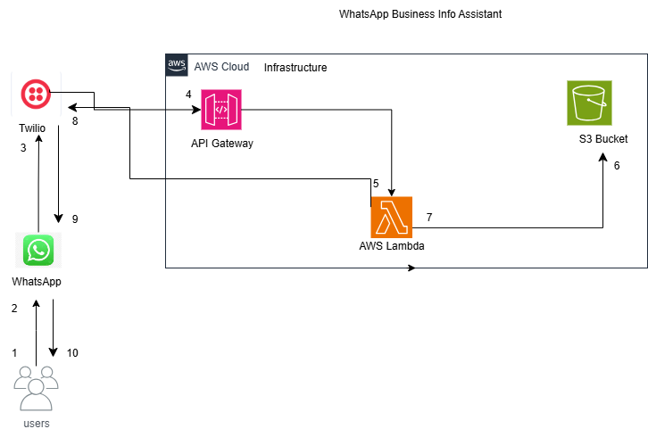

WhatsApp Business Info Assistant (WBIA)

Overview

Tech Stack: Amazon S3, AWS Lambda, API Gateway, Python, Twilio WhatsApp API

This project is a WhatsApp Business Info Assistant that allows small business owners to automatically answer customer enquiries (e.g., services, location, operating hours) by reading from a business PDF stored in S3.

It uses AWS cloud services and lightweight NLP to deliver real-time, document-driven answers over WhatsApp.

Architecture

Watch demo below

Key features

-  Receive and respond to WhatsApp messages instantly  
-  Read and understand structured files from S3 (like services and operating hours, policies, menus)
- Automatically answer customer queries  
- Fully serverless and scalable (built on AWS)  
-  Secure integration with API Gateway
- JSON event testing support (for Lambda testing)

 Premuim (planned)
 
 - AI-powered natural language understanding
  - Multi-language support
  - Advanced booking workflows
  - Analytics & reporting dashboard

 Tech Stack

- Python - core Lambda function
- AWS S3 – for storing business files
- AWS Lambda – for reading files and processing user queries
- API Gateway– for exposing the Lambda as a REST endpoint
- CloudWatch- Logs and monitoring
- Twilio WhatsApp API– recieves and sends messages
- JSON Simulation - for offline testing during development
- Visual Studio Code- Code editor
- Terraform- Automation

How it works 

1. User sends a question via WhatsApp.
2. Twilio forwards the message to API Gateway.
3. API Gateway triggers AWS Lambda.
4. Lambda fetches data from S3 and processes the question
5. Response is generated and sent back WhatsApp.

Business Value

This project demonstrates how  Cloud Automation can streamline customer interaction:

- Businesses save time by automating FAQs & bookings.
- Customers get instant answers without downloading extra apps.
- Scales globally with minimal infrastructure cost.

For security reasons, some functionality and sensitive configuration have been removed from this public version. Employers, partners, or recruiters can request full access or demo credentials upon request.

Why This Project Matters

The WhatsApp Business Info Assistant (WBIA) solves a real-world problem faced by small businesses, service providers, and large organizations: 24/7 customer support without the cost and complexity of human agents or chatbots that require expensive infrastructure.

Universal Use Case: Every business receives repetitive customer questions. This assistant automates those answers through WhatsApp—one of the most used messaging platforms globally—making it instantly useful across industries.

 End-to-End Automation: It showcases my ability to integrate cloud services (AWS Lambda, S3, API Gateway) with real-world messaging platforms (Twilio WhatsApp), demonstrating full-stack automation skills.

 AI + Cloud + Automation: The solution combines artificial intelligence (natural language understanding) with serverless cloud architecture, highlighting my ability to build scalable, intelligent systems from scratch.

Job-Ready & Client-Ready: This project is structured and documented to reflect real engineering workflows—from architecture and testing to API integration and AI-powered query handling. It's not just a demo—it's deployment-ready.

Security-Aware: Sensitive environment values (e.g., S3 buckets, Twilio credentials) are protected using best practices, showing awareness of production-level development.

Scalable & Monetizable: Built with growth in mind. It can scale to handle hundreds of clients or be productized into a SaaS (Software as a Service) model—making it an ideal candidate for real-world deployment or startup incubation.

If you're an employer or client reviewing this, the entire architecture and codebase is modular, secure, and production-focused. Additional business documents, secrets, or configuration files can be provided upon request.

Author

Valencia Lukhele
AI & Cloud Automation Engineer
 Building scalable automation solutions for businesses