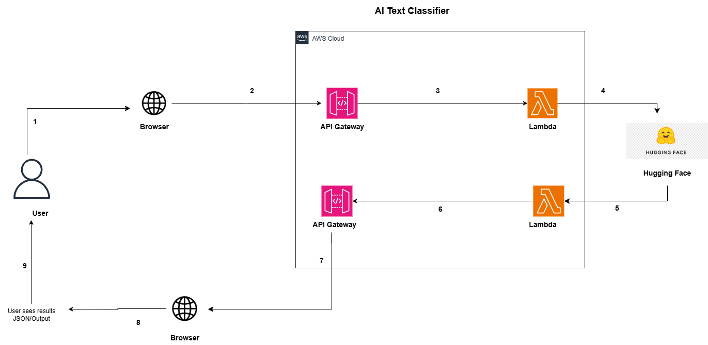

AI Text Classifier
Overview

Tech Stack: Python, AWS Lambda, API Gateway, Amazon S3, / Hugging Face Transformers

This project is an AI Text Classifier that allows businesses to automatically categorize textual data (e.g., support tickets, customer feedback, product inquiries) by leveraging a trained AI model stored and served via AWS.

It uses AWS cloud services and AI/NLP to deliver real-time, intelligent text classification for business automation and analytics.

Architecture

Key Features

- Receive text input and classify it instantly
- Supports structured and unstructured text (emails, messages, documents)
- AI-powered predictions for multiple categories
- Fully serverless and scalable (built on AWS)
- Secure integration with API Gateway
- JSON event testing support (for Lambda testing)

Premium (planned)

- Continuous model training pipeline
- Multi-language classification
- Advanced analytics dashboard
- Integration with messaging platforms or internal tools

Tech Stack

- Python – core Lambda function and AI model
- AWS S3 – for storing trained models and datasets
- AWS Lambda – for processing input and running AI predictions
- API Gateway – exposing Lambda as a REST endpoint
- CloudWatch – logs and monitoring
- JSON Simulation – offline testing during development
- Visual Studio Code – code editor
- Terraform – automation

How it works

- User sends text input via an API or web interface
- API Gateway receives the request and triggers AWS Lambda
- Lambda loads the AI model from S3 and processes the text
- Predicted category is generated
- Response is sent back via API

Business Value

- This project demonstrates how AI + Cloud Automation can streamline business workflows:
- Saves time by automating text categorization and routing
- Provides real-time insights into customer feedback and requests
- Scales globally with minimal infrastructure cost

For security reasons, sensitive configuration and full models are not included in this public version. Employers, partners, or recruiters can request full access or demo credentials upon request.

Why This Project Matters

The AI Text Classifier solves a real-world problem faced by businesses of all sizes: efficiently handling massive amounts of textual data without manual effort.

Universal Use Case: Every organization receives text data—support emails, reviews, tickets, and messages—that must be categorized for proper handling. This AI solution automates that process, saving time and reducing human error.

End-to-End Automation: Demonstrates my ability to integrate cloud services (AWS Lambda, S3, API Gateway) with AI models to deliver production-ready solutions.

AI + Cloud + Automation: Combines natural language understanding with serverless cloud architecture, showcasing my ability to build intelligent, scalable systems from scratch.

Job-Ready & Client-Ready: Structured and documented to reflect real engineering workflows—from architecture and testing to API integration and AI-powered processing. Deployment-ready.

Security-Aware: Sensitive environment values (e.g., S3 buckets, model artifacts) are protected using production-level best practices.

Scalable & Monetizable: Built with growth in mind. Can handle hundreds of clients or scale into a SaaS product, making it ideal for deployment or startup incubation.

Author

Valencia Lukhele
AI & Cloud Automation Engineer
Building scalable automation solutions for businesses