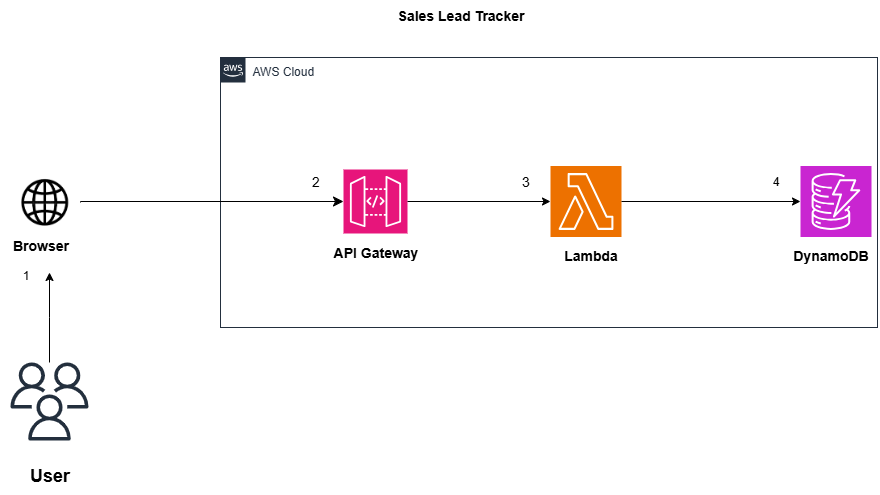

Sales Lead Tracker (AWS)
Overview

Tech Stack: AWS (Lambda, API Gateway, DynamoDB, S3, SNS), Python, Terraform, GitHub, Browser/API

The Sales Lead Tracker is a cloud-based automation tool that allows businesses to collect, process, and track sales leads efficiently. Leads can be submitted via a web form or CSV upload, stored securely in AWS, and automatically notify sales teams when new leads are received.

This project demonstrates enterprise-level cloud automation, serverless architecture, and workflow management—all free-tier safe and ready for portfolio or client use.

Arcitecture

Key Features

- Receive sales leads via API (JSON payload) or CSV uploads
- Store leads in DynamoDB for structured querying
- Save raw CSV files in S3 for backup
- Automatically notify sales teams via SNS
- Optional AI enrichment: lead scoring or company classification
- Fully serverless, AWS-free tier safe, and easily deployable

Planned Premium Features

- Automated follow-ups using SES (email)
- Lead analytics dashboards with AWS QuickSight
- Multi-team access with role-based permissions
- AI-driven insights (OpenAI API) for lead quality prediction

Tech Stack

- AWS Lambda – serverless lead processing
- API Gateway – endpoint for lead ingestion
- DynamoDB – structured lead database
- S3 – raw CSV storage
- SNS – notifications to sales team
- Terraform – infrastructure as code (IaC)
- Python – backend logic
- GitHub – version control and CI/CD pipeline

How it works:

- Lead submitted via web form (JSON) or CSV upload
- API Gateway triggers Lambda function
- Lambda parses, validates, and optionally enriches lead data
- Lead stored in DynamoDB
- Raw CSV uploaded to S3
- Notification sent via SNS to sales team

Business Value

- Automates lead collection: eliminates manual entry from forms or CSV files
- Immediate team notifications: no delay in follow-up
- Free-tier safe: can run indefinitely without costs for small businesses
- Scalable & extensible: ready to add AI insights, dashboards, and multi-team workflows

This project mirrors real enterprise sales tracking systems, demonstrating skills in cloud architecture, serverless workflows, automation, and Python scripting.

Why This Project Matters

- The Sales Lead Tracker solves a real-world sales workflow problem:
- usinesses need fast, automated lead ingestion and notifications
- Demonstrates serverless architecture, cloud automation, and workflow orchestration

Free-tier safe: ideal for experimentation and small-scale deployment
Extensible: can add AI scoring, dashboards, or multi-team support

Author

Valencia Lukhele
AI & Cloud Automation Engineer
Building scalable automation solutions for businesses and individuals